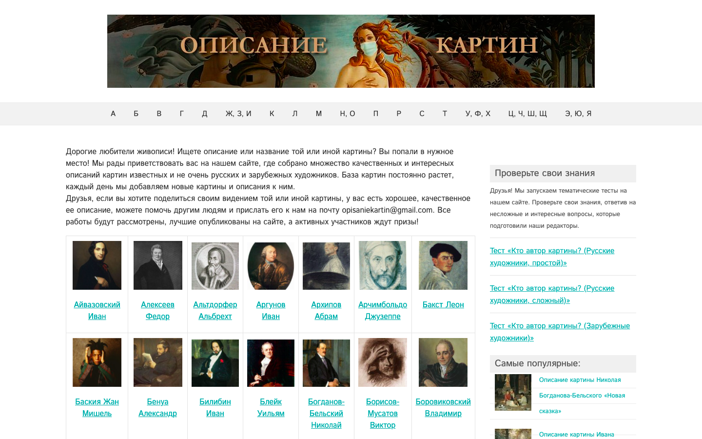
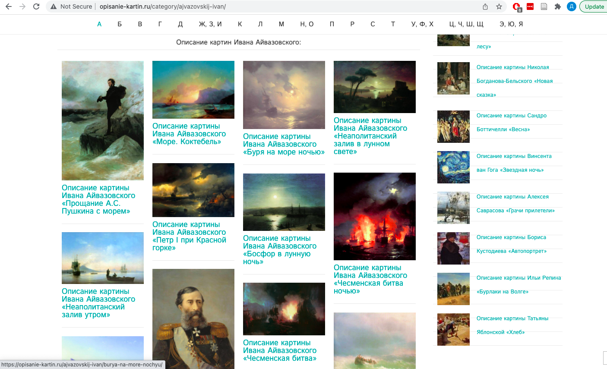
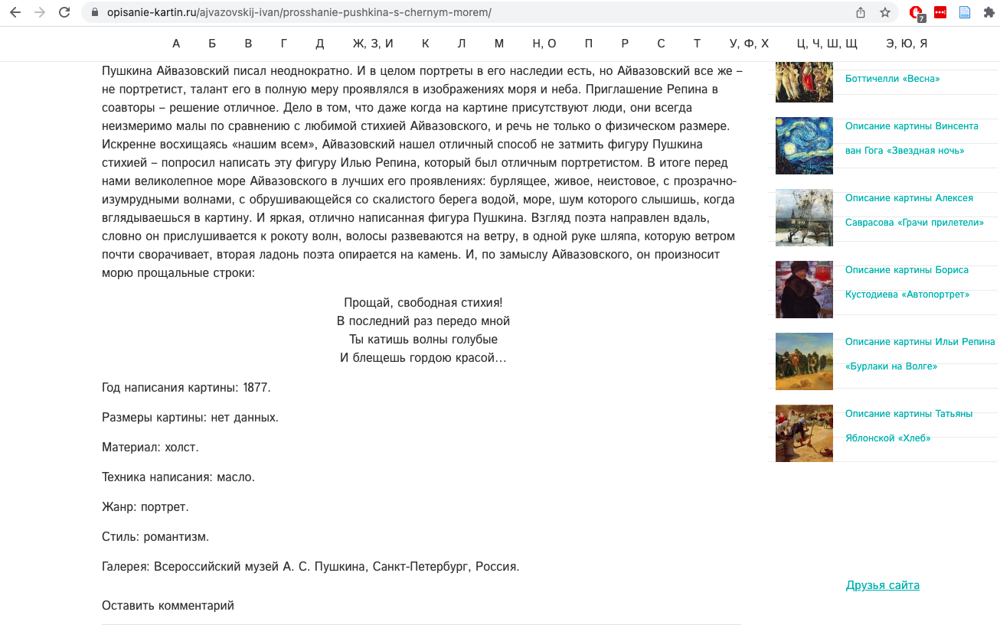

# 10-hw
homework 10 (web scraping)

1. В этом задании я предлагаю провести небольшое исследование и посмотреть, **как различаются частотные слова в описаниях картин в зависимости от их стиля**. Это будет маленькое учебное микроисследование, потому что мы проведем его на материале всего одного сайта, структура которого показалась мне удачной для парсинга. Но как модель, мне кажется, выполнение этого задания может вам помочь потом с более крупными исследованиями.  

2. Итак, вам предлагается взять сайт https://opisanie-kartin.ru/ Он устроен так: на главной есть ссылки на персональные **страницы художников**:

На страницах художников есть **описания картин**: 

В описании есть **текст и некоторые метаданные**, например стиль, дата создания (впрочем, метаданные не выделенны тегом, поэтому их придется достать регекспами/строковыми методами): 

3. Предлагаю вам обкачать этот сайт, а дальше посчитать и визуализировать частотности слов в описаниях картин (естественно, отфильтровав стоп-слова). Т.е. мы хотим получить частотности слов во "всех описаниях соцреализма", "всех описаниях романтизма" и т.д. и глазами их сравнить. Выбор вариантов визуализации частотных слов — на ваш вкус, можно проявить фантазию и умение гуглить. 

4. В отличие от предыдущих, это задание можно и лучше сдать в виде тетрадки (ipynb). Автопроверок не будет, мы все посмотрим глазами. Что будет влиять на оценку:

*   использовали ли вы библиотеку для отправки http-запросов (мы проходили requests, но можно пользоваться и другими типа urllib, если вдруг хотите)
*   использовали ли вы библиотеку для разбора HTML (мы проходили bs4 и совсем чуть-чуть lxml, так что наверно дефолтный вариант bs4)
*   будет ли ваш код работать, если какому-нибудь художнику добавят еще одну картину
*   творческий подход к исследованию: не сдерживайте себя, если хочется изучить что-то кроме различий между стилями. Мы все-таки учимся программировать не ради программирования, а как исследовательскому навыку :)

**Просьба**: если создаете какие-то промежуточные файлы и папки, то при обращении к ним используйте в коде относительные пути, а не абсолютные. Чтобы проверяющий мог при необходимости перезапустить ваш код, не заменяя какое-нибудь "С:\\Masha\\HW10\\all_html" на просто "all_html". Или можно завести переменные под все пути в каком-то блоке в самом начале кода, чтобы их удобно было поменять при запуске с другого устройства. 
